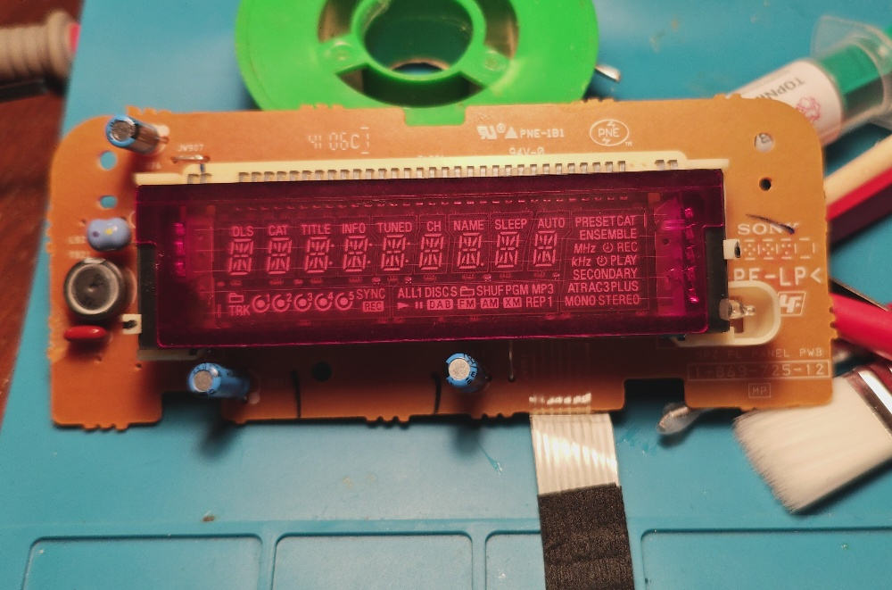

# RP2040 Sony VFD Driver

Driver for a Sony VFD Display (Model **1-869-725-12**) based on the **PT6315** controller, implemented on an **RP2040-Zero** microcontroller.

## Project Overview
The goal of this project is to upcycle a VFD module from vintage Sony audio equipment. Control is achieved via a custom SPI-like protocol.

## Hardware
*   **Display:** Sony 1-869-725-12 (VFD)
*   **Driver IC:** PT6315 (NEC/Renesas compatible)
*   **MCU:** RP2040-Zero (Waveshare/Raspberry Pi)
*   **Interface:** Custom SPI (Data, Clock, Strobe)
*   **Power Supply:**
    *   Input: 12V DC
    *   Logic: 5V (for RP2040) -> 3.3V (Logic Level)
    *   VFD: 6.2V (Filament/Anodes)

## Wiring
Detailed connection and power supply information can be found in [WIRING.md](WIRING.md).

## Implementation Status
- [x] Hardware analysis and pinout
- [x] Wiring documentation
- [x] Basic PT6315 Driver (MicroPython)
- [x] Mapping Tool with UI and Persistence
- [x] Category-based Mappings (JSON)
- [x] Segment Mapping

## Mapping Tool
Use `mapping_tool.py` to identify segments.
- Supports **Category_Name** format (e.g., `rightLabels_play`, `d1_a`).
- Saves to `mappings.json`.
- Uses **12 Digits / 16 Segments** mode (Grid 0-11, Bits 0-15).

## PT6315 Protocol (Brief)
The PT6315 communicates serially (LSB First).
1.  **Instruction** (Command)
2.  **Data** (Optional)
3.  **Strobe** (Latch)

Key signals: CLK, DIN, STB.

## Getting Started
1.  Verify voltages (5V on MCU, 6.2V on VFD).
2.  Upload `vfd.py` and `main.py` to the RP2040.
3.  Run `main.py` to verify the display (Test Pattern).
4.  Run `mapping_tool.py` to help map the segments.
